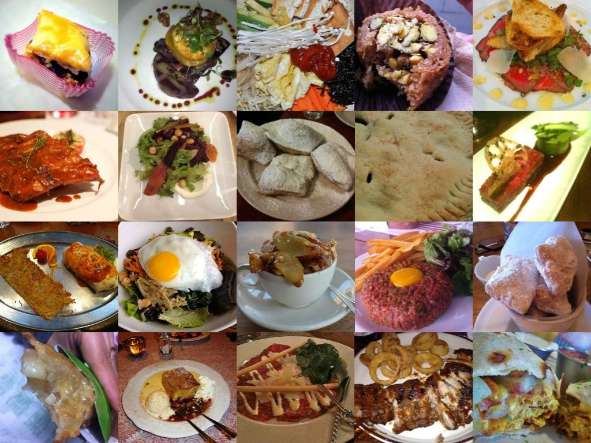

# food-MNIST Dataset

## Introduction
This data set consists of 10 food categories, with 5,000 images. For each class, 125 manually reviewed test images are provided as well as 375 training images. On purpose, the training images were not cleaned, and thus still contain some amount of noise. This comes mostly in the form of intense colors and sometimes wrong labels. All images were rescaled to have a maximum side length of 512 pixels.



## Food Classes
1. apple pie
1. baby back ribs
1. baklava
1. beef carpaccio
1. beef tartare
1. beet salad
1. beignets
1. bibimbap
1. bread pudding
1. breakfast burrito

## Directory Structure:
```
food-MNIST/
    images/
        <class_name>/
            <image_id>.jpg
    meta/
        classes.txt
        test.json
        test.txt
        train.json
        train.txt
```
## APIs

### API 1: load_data(width, height)

 **Returns:**  
It returns two tuples
1. x_train, x_test: uint8 array of RGB image data with shape (num_samples, width, height, 3) from the image_data_format backend setting o either channels_first or channels_last respectively.
2. y_train, y_test: uint8 array of category labels (integers in range 0-9) with shape (num_samples,).

### API 2: labels()
**Returns:** dictionary of labels

---

**Example**

      (x_train, y_train), (x_test, y_test) = food_mnist.load_data()
      labels_dict = food_mnist.labels()

## Usage

### Download for custome usage
```
git clone https://github.com/srohit0/food_mnist.git
import mnist_food
...
...
(x_train, y_train), (x_test, y_test) = food_mnist.load_data()
labels_dict = food_mnist.labels()
```

### Working with Colab 

1. Here is a simple [example of using food_mnist in google colab notebook](https://colab.research.google.com/drive/1Pad2yvBw21MVbyPLmKMPQbGMucAFg8YQ)
2. Here is a complete [example of training food-MNIST dataset on a simple network with over 75% training accuracy](https://colab.research.google.com/drive/1IMCmRKZuiEd5Gn4d16AY31hNnu_k__NG#scrollTo=a5mrxXuz8KHK)


## Reference
Original paper on [Food-101 – Mining Discriminative Components with Random Forests](https://www.vision.ee.ethz.ch/datasets_extra/food-101/static/bossard_eccv14_food-101.pdf)

### Disclaimer
This dataset was created out of necessity to train food-samples on smaller machine with under 8GB RAM. Source of this dataset is [Food-101 dataset](http://data.vision.ee.ethz.ch/cvl/food-101.tar.gz)

**Credit:**
All images can be found in the "images" folder and are organized per class. All image ids are unique and correspond to the foodspotting.com review ids. Thus the original articles can retrieved trough http://www.foodspotting.com/reviews/<image_id> or through the foodspotting api (http://www.foodspotting.com/api). The test/train splitting used in the experiment of our paper, can be found in the "meta" directory. For any questions on the original Food-101 dataset contact bossard@vision.ee.ethz.ch
